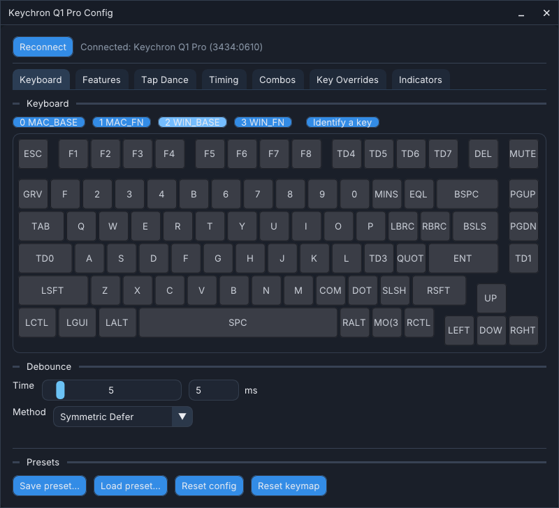
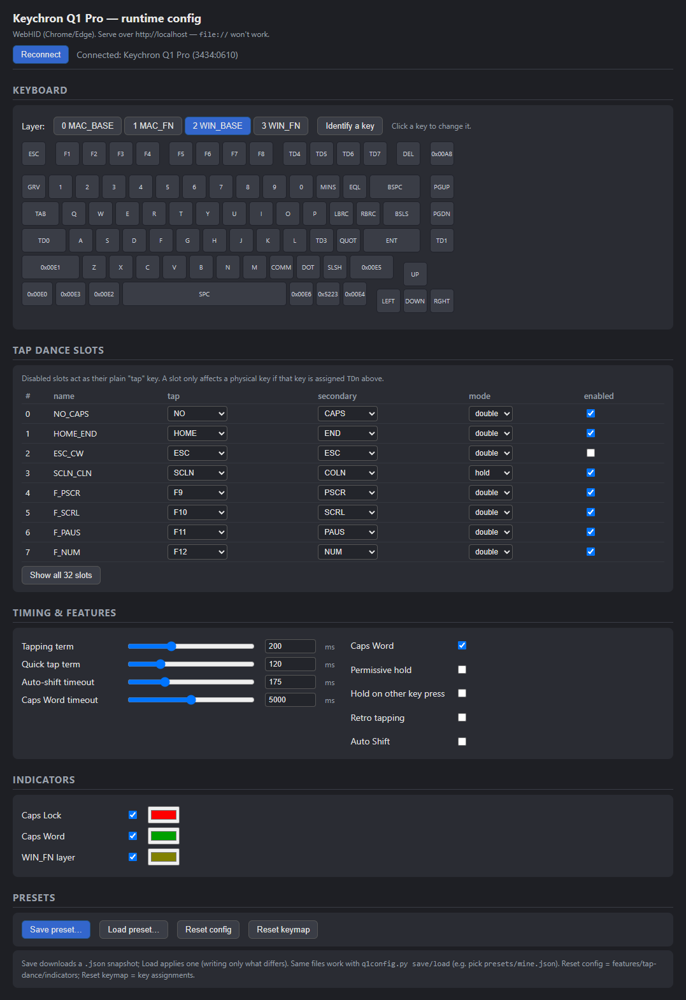

# Smial

Live page: <https://opcow.github.io/smial/>

Repository: <https://github.com/opcow/smial>

Host-side configuration tools for Keychron keyboards running a
QMK `rtcfg` keymap that exposes a raw-HID runtime-config interface (command byte `0xAC`).
Change tap dance, tapping term, Caps Word, Auto Shift, combos, key overrides, key assignments,
macros, RGB lighting, and RGB state indicators **at runtime** — no recompile/reflash — and
save/load configurations as files.

> **Requires a one-time firmware flash.** These tools only work once the board is running the
> custom `rtcfg` firmware build (see the **Companion firmware** note below) — the
> stock Keychron firmware won't respond. The flash is a one-time step; after it, day-to-day
> changes are made live over USB with no further reflashing.
>
> **VIA still works.** The `rtcfg` build keeps full VIA compatibility — VIA/Vial can still
> connect and remap keys as usual. (Settings made through these tools live in the keyboard's
> own config and simply aren't shown in the VIA GUI; they don't interfere with it.)

Three front-ends over the same protocol:

- **`smial`** — a native desktop GUI (C++ / Dear ImGui) with a graphical keyboard, a
  categorized keycode picker, tap-dance editor, combo and key-override editors, timing,
  indicator, lighting, and macro controls, and presets. The same binary doubles as a
  command-line tool when given arguments. No Python needed.
- **`smial.html`** — a single-file browser GUI (WebHID; Chrome/Edge) with a graphical
  keyboard, key remapping, tap-dance editor, combo and key-override editors, sliders/toggles,
  color pickers, and lighting and macro editors, and presets.
- **`smial.py`** — command-line tool (Python + `hidapi`).

> Companion firmware: the `rtcfg` keymap in the QMK tree —
> [opcow/qmk_firmware @ raw-hid-config](https://github.com/opcow/qmk_firmware/tree/raw-hid-config/keyboards/keychron/q1_pro/ansi_knob/keymaps/rtcfg)
> (note: the `q1_pro` board lives on the `raw-hid-config` branch, not `master`). This app
> only does anything once that firmware is flashed. The wire format is in [PROTOCOL.md](PROTOCOL.md).

**Adding this to another keyboard?** See [PORTING.md](PORTING.md) — how the firmware works
and step-by-step instructions for adding a compatible real-time-config interface to any QMK
board that lacks a Vial port.

## Screenshots

Native app:



Browser GUI:



## Requirements

- **Windows, macOS, or Linux.** (WSL2 can't reach the device without usbipd.)
- For the **native app**: a C++17 compiler and **CMake ≥ 3.20**. Dependencies (GLFW, Dear
  ImGui, hidapi, nlohmann/json, nativefiledialog) are fetched automatically by CMake.
  On Linux also install `libudev-dev` and `libgtk-3-dev`.
- For the **Python CLI**: **Python 3** and `pip install -r requirements.txt` (just `hidapi`).
- For the **browser GUI**: a **Chromium browser** (Chrome/Edge) that supports WebHID.

## Native app

Build the single `smial` binary (it is both the GUI and the CLI):

```powershell
cmake -B build
cmake --build build --config Release
```

Run it with **no arguments** to launch the desktop GUI:

```powershell
build\Release\smial.exe        # Windows
./build/smial                  # macOS/Linux
```

Connect the keyboard and use the **Keyboard / Features / Tap Dance / Timing / Combos /
Key Overrides / Indicators / Lighting / Macros** tabs; click any key to open the categorized
keycode picker. Save/Load presets use a native file dialog and share the same JSON format as
the other front-ends.

Pass a **command** to use the same binary as a CLI instead of opening the window:

```powershell
smial features          # feature flags + timing params
smial tt 220            # set tapping term (ms)
smial td 64             # show tap-dance slots (default 8, max 64)
smial indicators        # RGB indicator states
smial keymap 4 dump.txt # dump 4 layers' keycodes to a file
smial save work.json    # snapshot config to a JSON preset
smial load work.json    # apply a preset
smial reset             # config back to firmware defaults
smial reset-keymap      # full keymap back to firmware defaults
```

Run `smial help` for the full command list. (On Windows the GUI build is a windowed
binary; when run with a command it re-attaches to the parent console for output.)

## Python CLI

```powershell
python smial.py            # show global config
python smial.py list       # all tap-dance slots
python smial.py tt 220     # set tapping term (ms)
python smial.py mode 3 hold; python smial.py en 3 1   # ;/: tap-hold
python smial.py indicator capslock on #ff0000          # red Caps Lock
python smial.py id          # press a key -> prints its row/col
python smial.py assign 2 3 10 5   # make a key trigger tap-dance slot 5

# presets (JSON files in ./presets/)
python smial.py presets    # list
python smial.py save work  # snapshot current config -> presets/work.json
python smial.py load mine  # apply a preset (writes only what differs)
python smial.py mine       # alias for `load mine`
```

Run `python smial.py help` (or any unknown command) to see the full command list.

## Browser GUI

WebHID requires a secure context, so serve over `localhost` (a plain `file://` open won't work):

```powershell
python -m http.server 8000
```

Then open **<http://localhost:8000/smial.html>** in Edge/Chrome, click **Connect**, and
authorize the keyboard. Save/Load presets use browser download / file picker; the JSON
format is identical to the other front-ends', so preset files are interchangeable.

## Presets

A preset is a full snapshot of the runtime config (timing, feature flags, all tap-dance
slots as keycode names, and indicator colors as hex) — human-readable and shareable.
`presets/mine.json` is the maintainer's personal setup; it's just a regular preset (load
it, edit it, or branch new ones with `save`). All three front-ends read and write the same
JSON, so presets are interchangeable between them.
